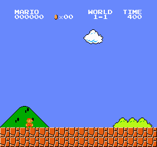

# [PYTORCH] Reinforcement Learning-Super Mario Bros Using CNNPolicy


## Packages Used:
* gym-super-mario-Bros == 7.3.2
* gym == 0.21.0
* ipykernal
* Stable-Baselines3
* Pytorch 1.13

## Setting Up Pytorch
_I would recoomend you to check official Pytorch website to install it_<br>
**The Pytorch need the exact version of Cuda and CUDnn to work normally**<br>
Pytorch website: [`pytorch`](https://pytorch.org/get-started/locally/)

## Creating Virtual Environment:
setting up a virtual environment will really help in Creating a seperatiion wwithin your workspace and PC<br>
**Run following to create a virtual environment**
* launch cmd 
* move to your desired directory
* Run the following:
```python -m venv mario```
activate your virtual env using following:<br>
```.\mario\Scripts\activate```<br>
to deactivte just type _deactivate_ in cmd
## Creating a New kernel in Jupyter Notebook
After installing Ipykernal run the following:<br>
```python -m ipykernel install --user --name=mario```<br>
##### _note: the name of kernel should be same as venv name_
## Training the Agent
Either clone my repo or download the zip or copy paste the code and run them<br>
Github clone Link: https://github.com/harikris001/Super-Mario-Reinforcement_Learning.git <br>
Run the cells and wait for it to complete.
## After Training: 
|OUTPUT           ||||
|-----------------|------|------|------|
|Sl.NO            |1     |2     |3     |
|Total Steps      |.5M   |1M    |1.5M  |
|Completed Level  |False |False |False |
|OUTPUT           ||||
|-----------------|------|------|------|
|Sl.NO            |4     |5     |6     |
|Total Steps      |2M    |2.5M  |3M    |
|Completed Level  |False |False |False |
|OUTPUT           ||||
|-----------------|------|------|------|
|Sl.NO            |7     |8     |9     |
|Total Steps      |3.5M  |4M    |4.5M  |
|Completed Level  |False |False |False |
|OUTPUT           |||
|-----------------|------|------|
|Sl.NO            |10    |11    |
|Total Steps      |5M    |5.5M  |
|Completed Level  |False |False |


**I have attached the Pre trained models u can resume training using these model and save the result**<br>
**The best model during my training was 4M model so i have attached that**
